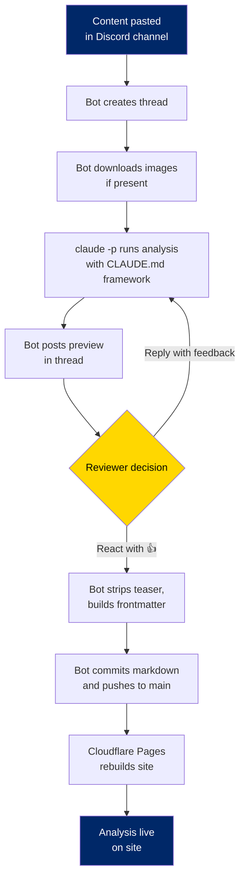

# Rhetorical Autopsy

Structural analysis of divisive social media content — how persuasion works, not what to believe.

## What This Is

Rhetorical Autopsy is a media literacy tool that analyzes the **mechanics** of persuasive and divisive content. It identifies the specific techniques a post uses — emotional escalation, tribal framing, fabricated authority, thought-terminating clichés — names them, quotes the language doing the work, and explains why they work psychologically.

It is not a fact-checker. It does not take political sides. The same framework applies to content from any direction. The analysis reads like a medical examiner's report: cause of death, not eulogy.

## How It Works

Content goes in. A structured analysis comes out.

Each analysis runs through a framework grounded in published research:

- **Emotional Architecture** — activation emotion, escalation pattern, exit ramp ([Nabi & Green, 2015](https://doi.org/10.1080/15213269.2014.912585))
- **Cialdini's Principles of Influence** — reciprocity, commitment, social proof, authority, liking, scarcity, unity ([Cialdini, 2006](https://www.amazon.com/dp/006124189X))
- **Source Existence Check** — are the cited institutions, studies, and experts real or fabricated?
- **Thought-Terminating Clichés** — phrases that feel like insight but prevent actual analysis ([Lifton, 1961](https://www.amazon.com/dp/1614276757))
- **Moral Foundations Targeting** — which psychological buttons is the content pushing, and for which audience? ([Haidt, 2012](https://www.amazon.com/dp/0307455777))
- **Framing Effects** — what true facts are present, what's missing, and what the alternative frame looks like ([Kahneman & Tversky, 1984](https://doi.org/10.1037/0003-066X.39.4.341))
- **Identity-Threat Construction** — content structured so disagreeing threatens the reader's self-concept ([Sherman & Cohen, 2006](https://doi.org/10.1016/S0065-2601(06)38004-5))

The theoretical basis is **inoculation theory** ([McGuire, 1964](https://doi.org/10.1016/S0065-2601(08)60052-0); [van der Linden et al., 2017](https://doi.org/10.1002/gch2.201600008)): exposing people to persuasion tactics in weakened, explained form builds cognitive resistance against future manipulation. Same principle as a vaccine.

## How a Post Gets Made



## Architecture

```
rhetorical-autopsy/
├── src/                    # Eleventy static site
│   ├── analysis/           # Published analyses (markdown + YAML frontmatter)
│   ├── _includes/layouts/  # Nunjucks templates
│   ├── _data/              # Site metadata
│   └── assets/             # CSS, images
├── bot/                    # Discord bot (TypeScript)
│   └── src/
│       ├── index.ts        # Channel listener, thread-based preview/revision
│       ├── analyze.ts      # Shells out to claude CLI for analysis
│       ├── publish.ts      # Builds markdown, commits, pushes
│       └── state.ts        # Thread state management
├── eleventy.config.js      # Site build configuration
└── CLAUDE.md               # Analysis framework (system prompt)
```

**Site:** Static HTML generated by [Eleventy 3.x](https://www.11ty.dev/). Analysis posts are markdown files with YAML frontmatter. Two-column layout: original post sidebar + analysis content.

**Analysis engine:** The [`claude` CLI](https://docs.anthropic.com/en/docs/claude-code) (`claude -p`) with `CLAUDE.md` as the system prompt. No Anthropic SDK, no API key — uses CLI account credentials. The framework in `CLAUDE.md` defines every detection tier, output format, and research citation.

**Bot:** A Discord bot that listens for content in a channel, creates a thread, runs the analysis, posts a preview, accepts revision feedback, and on approval commits the markdown and pushes to trigger a site rebuild.

## Running Locally

**Site:**

```bash
npm install
npm run dev       # http://localhost:8080
npm run build     # outputs to _site/
```

**Bot:**

```bash
cd bot
npm install
npm run dev       # requires DISCORD_TOKEN and DISCORD_CHANNEL_ID in bot/.env
```

The bot requires the `claude` CLI installed and authenticated.

## License

The analysis framework and site code are open source. Published analyses are original content.
